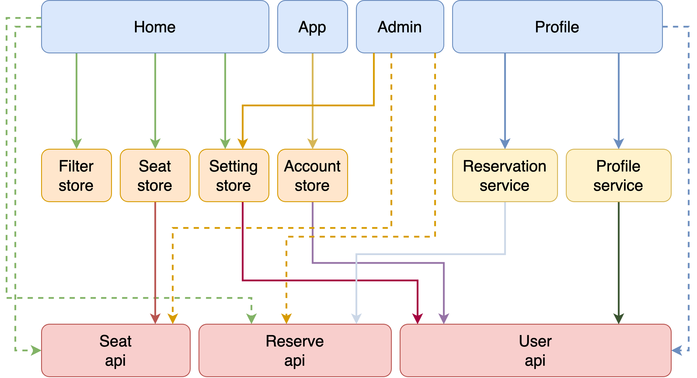

# 全興書苑預約平台

## 介紹

全興書苑預約平台是一個提供全興書苑場地預約服務的平台，使用者可以透過此平台查看全興書苑場地的預約狀況，並進行預約和查看自己的預約紀錄。

## 功能

- 查看全興書苑場地的預約狀況
- 進行場地預約
- 查看個人預約紀錄

## 系統架構

### 系統架構圖



說明：

- 藍色組件代表 View 視圖，負責顯示畫面
- 橘色組件代表 Pinia Store 狀態管理，負責管理應用程式狀態
- 黃色組件代表 Service 服務，負責處理共用業務邏輯
- 紅色組件代表 API 服務，負責與Supabase進行通訊

註：此為依賴圖，箭頭指向代表依賴關係，不同顏色僅為區分不同類型組件，虛線箭頭代表 View 視圖是直接依賴 API 服務的，應該避免直接依賴 API 服務，建議後續可以優化。

#### View 視圖

- **App**：應用程式的根組件，包含 Navbar, Footer, SignInDialog, SignUpDialog 等組件
- **Home**：首頁，顯示全興書苑場地的預約狀況
- **Profile**：個人資料頁面，顯示個人預約紀錄
- **Admin**：管理員頁面，顯示所有預約紀錄、管理使用者/座位、修改設定等

#### Pinia Store 狀態管理

- **AccountStore**：管理使用者資訊，包含登入狀態、使用者資料等
- **SettingStore**：管理應用程式設定，包含全興書苑場地資訊、預約規則等
- **SeatStore**：管理座位資訊，包含座位狀態、預約紀錄等
- **FilterStore**：管理過濾條件，包含日期時間等，並提供給 SeatMap 等組件使用

#### Service 服務

`vue 3` 的 Service 通常以 `composable` 的形式提供。

- **ReservationComposable**：提供預約相關業務邏輯，包含查看預約紀錄。
- **ProfileComposable**：提供個人資料相關業務邏輯，包含查看個人資料、修改個人資料等。

#### API 服務

- **SupabaseService**：設定 Supabase 連線，提供與 Supabase 進行通訊的方法
- **SeatAPI**：提供與座位相關的 API 服務，包含查詢座位狀態、預約座位等
- **UserAPI**：提供與使用者相關的 API 服務，包含查詢使用者資料、修改使用者資料等
- **ReservationAPI**：提供與預約相關的 API 服務，包含查詢預約紀錄、新增預約紀錄等

### 技術棧

- 前端框架：Vue 3.3.11
- 資料庫：Supabase 2.43.5

#### 相關套件

- **Element Plus 2.6.3**：提供 UI 元件
- **Vueuse 10.9.0**：提供實用功能
- **Konva 9.3.0 / vue-konva 3.0.2**：提供繪製圖形功能
- **vue-router 4.2.5**：提供路由功能
- **Pinia 2.1.7 / pinia-plugin-persistedstate 3.2.1**：提供狀態管理及持久化功能

## 開發

### 環境需求

使用 Bun 1.0.25 進行開發。

#### 安裝 Bun

詳見 [官方文件](https://bun.sh/docs/installation)

### 開發步驟

開發分為兩個部分：啟動前端及啟動 Supabase。

1. 安裝相依套件

```bash
bun install
```

2. 啟動開發伺服器

```bash
bun dev
```

3. 打開瀏覽器並前往 `http://localhost:3000` 查看網站
4. 啟動 Supabase

```bash
git clone https://github.com/supabase/supabase.git
cd supabase/docker
docker compose up -d
```

5. 打開瀏覽器並前往 `http://localhost:8000` 查看 Supabase 管理介面
6. 確認前端可以正常連接 Supabase

## 部署

使用 Docker 進行部署。

1. 建立 Docker Image

```bash
docker build -t book-reservation .
```

2. 啟動 Docker Container

```bash
docker run -d --network host book-reservation
```

使用 `--network host` 參數，讓 Docker Container 與本機共用網路，方便連接 Supabase。

3. 啟動 Supabase

```bash
git clone https://github.com/supabase/supabase.git
cd supabase/docker
docker compose up -d
```

## 資料庫: Supabase

### 設定 Supabase

```javascript
const SUPABASE_URL = 'http://localhost:8000'
const CLIENT_KEY = 'your-client-key'
const SERVICE_KEY = 'your-service-key'
```

### 資料庫設置：

設置資料庫時區為亞洲台北

```sql
ALTER DATABASE postgres
SET timezone TO 'Asia/Taipei';
```

創建 pg_cron 擴展

```sql
CREATE EXTENSION IF NOT EXISTS pg_cron;
```

### 枚舉類型：

使用者身分 (user_role)：

- student
- outsider

管理員身分 (admin_role)：

- admin
- assistant
- non-admin

### 用戶個人資料表 (user_profiles)：

- 欄位：
  - id: 主鍵，外鍵參考 auth.users 表的 id，並在刪除時級聯刪除
  - email: 電子郵件，唯一且不可為空
  - is_in: 表示是否在場內
  - point: 用戶積分，默認為0
  - name: 用戶姓名
  - phone: 用戶電話號碼，唯一
  - id_card: 用戶身份證號碼，唯一
- 行級安全 (RLS)：
  - 為管理員角色創建全權訪問策略
  - 允許用戶存取自己的資料
- 觸發器和函數：
  - set_user_metadata: 根據用戶的 email 來設置用戶角色及管理員角色，並儲存於 meta_data
  - create_user_profile: 在用戶註冊時自動新增 user_profile
  - ban_user_on_points_limit: 處理違規點數到達上限的情況
- 工具函數：
  - get_user_data: 取得所有用戶資訊，並支持多個過濾條件和分頁功能

### 黑名單表 (blacklist)：

- 欄位：
  - id: 主鍵，自動遞增
  - user_id: 用戶 ID，外鍵參考 user_profiles 表的 id，並在刪除時級聯刪除
  - reason: 黑名單原因
  - end_at: 黑名單結束時間
- 索引：
  - idx_blacklist_end_at: 為黑名單表的結束時間創建索引，以提高查詢效率
- 視圖：
  - active_blacklist: 篩選出當前有效的黑名單記錄
- 行級安全 (RLS)：
  - 為管理員角色創建全權訪問策略，允許執行所有操作
  - 為普通用戶創建查詢自己黑名單記錄的策略
- 函數：
  - is_not_banned: 檢查用戶是否不在黑名單中

### 校外人士註冊申請表 (outsider_sign_up_request)：

- 欄位：
- id: 主鍵，自動遞增
  - email: 電子郵件，不可為空
  - name: 名稱，不可為空
  - phone: 電話號碼，不可為空
  - id_card: 身份證號碼，不可為空
  - inserted_at: 插入時間，預設為當前時間
- 行級安全 (RLS)：
  - 設置管理員的全權訪問策略
  - 允許任何人新增資料
- 觸發器和函數：
  - check_duplicates_in_user_profiles: 檢查是否有重複的資料在 - user_profiles 中
  - trigger_check_duplicates: 當插入資料時檢查是否有重複的資料在 - user_profiles 中
- 工具函數：
  - check_insert_user_profile: 檢查插入 user_profiles 表中的資料是- 否唯一
  - get_outsider_sign_up_data: 取得外部註冊請求數據，支持多種過濾條件和分頁功能

### 設定表 (settings)：

- 欄位：
  - id: UUID 主鍵，預設值為生成的 UUID
  - key_name: 設定名稱，唯一且不可為空
  - value: 設定值，不可為空
  - description: 設定描述，可選
- 行級安全 (RLS)：
  - 允許管理員執行查詢和更新操作的政策
  - 允許普通用戶查詢設置信息的政策

### 關閉時段表 (closed_periods)：

- 欄位：
  - id: 主鍵，自動遞增
  - begin_time: 開始時間，不可為空
  - end_time: 結束時間，不可為空
- 索引：
  - idx_closed_periods_end_time: 為結束時間創建索引，以優化查詢性能
- 視圖：
  - active_closed_periods: 篩選當前有效的關閉時段
- 行級安全 (RLS)：
  - 為管理員創建全權訪問策略
  - 為普通使用者創建僅讀取權限的策略

### 座位表 (seats)：

- 欄位：
  - id: 主鍵，座位的唯一標識
  - available: 座位是否可用
  - other_info: 座位的其他信息
- 行級安全 (RLS)：
  - 允許管理員查詢和修改座位表
  - 允許所有使用者查詢座位表

### 預約表 (reservations)：

- 欄位：
  - id: UUID 主鍵，預設值為生成的 UUID
  - begin_time: 開始時間，不可為空
  - end_time: 結束時間，不可為空
  - user_id: 用戶 ID，外鍵參考 auth.users 表的 id，並在刪除時級聯刪除
  - seat_id: 座位 ID，外鍵參考 seats 表的 id，並在刪除時級聯刪除
  - check_in_time: 簽到時間
  - temporary_leave_time: 臨時離開時間
- 索引：
  - idx_reservations_end_time: 為預約紀錄的結束時間創建索引，以提高查詢效率
- 視圖：
  - active_reservations: 篩選當前有效的預約記錄
- 行級安全 (RLS)：
  - 為管理員角色創建全權訪問策略
  - 為普通使用者創建只能操作自己的預約資料的策略
- 觸發器和函數：
  - cls_reservations_update: 限制非管理員的更新範圍，確保僅允許更新 end_time - 欄位
  - check_early_termination_validity: 確認提早離開是否合法
  - check_reservation_validity: 檢查預約的合法性
  - check_seat_availability_and_reservation_conflict: 檢查所選座位的可用性以及- 預約時間是否與現有預約時間重疊
  - check_reservation_limits: 檢查預約設定限制
  - check_reservation_overlap_with_closed_periods: 檢查新的預約時間是否與任何- 已存在的關閉時段重疊
  - check_unfinished_reservation: 檢查用戶當天是否有未完成的預約
  - check_if_reservation_can_be_deleted: 檢查是否可以刪除預約
- 工具函數：
  - get_reservations: 取得當前用戶的預約資料及個人資訊，支持多種過濾條件和分頁- 功能
  - get_active_reservations: 取得當前活躍的預約資料及個人資訊

### 座位預約表 (seat_reservations)：

- 欄位：
  - seat_id: 座位 ID，外鍵參考 seats 表的 id，並在刪除時級聯刪除
  - begin_time: 開始時間，不可為空
  - end_time: 結束時間，不可為空
  - reservation_id: 預約 ID，外鍵參考 reservations 表的 id，並在刪除時級聯刪除
- 索引：
  - idx_seat_reservations_end_time: 為座位預約表的結束時間創建索引，以優化查詢- 效率
- 視圖：
  - active_seat_reservations: 篩選出活躍的座位預約，即預約尚未結束的座位
- 行級安全 (RLS)：
  - 為管理員創建政策，允許對座位預約表進行所有操作
  - 為所有用戶創建查詢政策
- 觸發器和函數：
  - sync_seat_reservations: 當 reservations 表有新的插入或更新時，同步這些變更- 到 seat_reservations 表
- 工具函數：
  - get_seat_active_reservations: 根據座位 ID 取得該座位的活躍預約資訊及預約用- 戶的個人資料，使用交叉連接搭配用戶資料函數

### CRON 日誌表 (cronlog)：

- 欄位：
  - log_time: 日誌記錄時間
  - log_msg: 日誌訊息
- 行級安全 (RLS)：
  - admin_all_access: 為管理員創建全權訪問策略
- 計時器函數：
  - process_reservation_time_violations: 用於檢查預約時間違規並處理相關事務，每分鐘檢查一次預約時間違規

### 使用者 Claims 函數：

請參閱 [github](https://github.com/supabase-community/supabase-custom-claims/blob/main/README.md)

### 用戶進出場記錄函數

- record_student_entry_exit: 記錄學生進出場狀態
- record_outsider_entry_exit: 記錄校外人士進出場狀態
